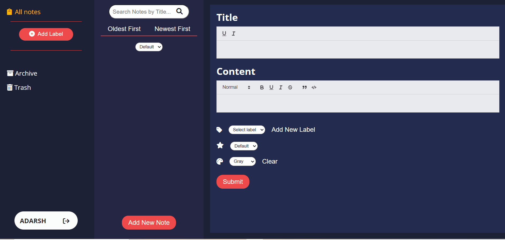

# [NoteStack](https://notestack.vercel.app/)

NoteStack is a note taking application where you can jot down quick thoughts. Take notes the simple way for free. Forever.

---

## How to Use

- Fork the project
- Run npm install in the terminal
- Run npm start to run project on your localhost

---

## Features

Currently GameShop has following features

- Authentication
  - Login
  - Signup
  - Logout
- Rich Text Editor
  - Add new note using the rich text editor which also shows the preview
  - Add background color to the note
  - Add multiple labels to the note
  - Sort priority to the note
  - Add note to archive
  - Trash a note
- View label specific notes
- Sort Notes based on time it was added
- Sort notes based on priority
- View a note
- Edit note
  - Edit using rich text editor
  - Edit background color
  - Edit labels
  - Edit priority of the note
- Archive a note
  - View archived note
  - Unarchive note
  - Add to trash from archive
- Trash Note
  - View trashed note
  - Restore a trashed note
  - Delete a note permanantly from trash section

---

## Build with

- React
- React Router
- [Mockbee](https://mockbee.netlify.app/) - for mock backend
- [Feather UI](https://feather-design.netlify.app/)
- React Toastify
- React Quill

---

## Folder Structure

```jsx
- /public
- /src
  - /Assets
  - /Components
  - /Context
  - /Pages
  - /Reducer
  - /Services
  - /Utils
  - /backend
  - App.css
  - App.js
  - index.css
  - index.js
  - server.js
- package-lock.json
- package.json
- yarn.lock
```

---

## Report an issue

If you would like to request a feature, or report a bug simple click [here](https://github.com/kart-c/notestack/issues/new). If it is a bug request, a brief description of the bug is appreciated. If you can reproduce the bug and attach an image or a video, that would be really helpful.

## Desktop Demo

<p align="center">
  
</p>

## Connect with me

<a href="https://twitter.com/kart_c11"></a>
<a href="https://www.linkedin.com/in/kartikeya-choudhary-92881621a/"></a>
